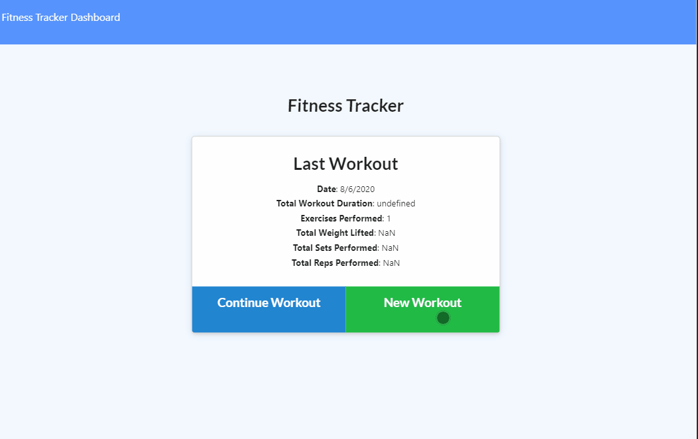

# Workout Planner with Diagrams 

### Table of Contents
- [Description](#description)
- [Usage](#usage)
- [License](#license)
- [Preview](#preview)
- [Questions](#questions)

## Description

  This web application allows the user to log their workout routine by adding exercises or update their previous exercises, with visualization of their routines through the use of charts and graphs. 

  Technologies Used : 

  * HTML
  * CSS
  * JS
  * MongoDB
  * Mongoose
  * NodeJS

## Usage

## License

MIT License 

## Preview

## Questions
GitHub: [Here](https://github.com/eddyangang/workoutplanner)

Deployed Site: [here](https://immense-coast-36647.herokuapp.com/?id=5f2e28200eabc800170065d0)